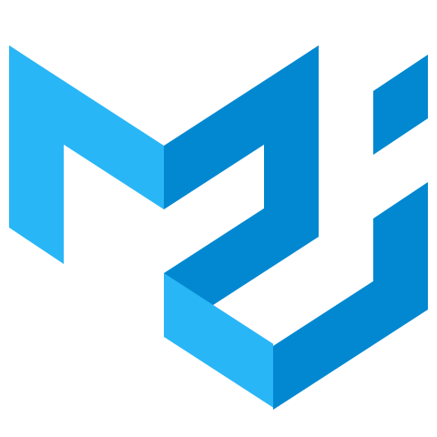

# VRAC Tool Center

## About this repository
This repository contains the several tools used by the VRAC association which participates in the "Coupe de France de robotique" every year.

VRAC Tool Center is devided into 2 sub projects : 
* REST service
* Web application
 
## Technical Stack
### Rest service
 

### User Interface
 
 

### Database
 

### Virtualizer
 

## Prerequisite
For rest service : <br>
* Install Java 8 <br>
* Install Maven <br>

For UI : <br>
* Install Node.js <br>

To launch containerized tool center : <br>
* Install Docker <br>
* Install Docker-compose <br>

## Technical Stack
* Database MongoDB
* API REST Spring
* UI React

## Installation and run "VRAC Tool Center"
* Download repository and go inside this folder
```bash
git clone https://github.com/PierreVerbe/VRAC-Tool-Center
cd VRAC-Tool-Center
```

* First start-up containerized app
```bash
docker-compose up
```

* Stop containerized app
```bash
docker-compose stop
```

* Start containerized app
```bash
docker-compose start
```

## Notes
* Publish a new release [file](resources/docs/release.md) <br>
* If you have issues look at this [file](resources/docs/issue.md) <br>
* Todo list [file](resources/docs/todo.md) <br>
* Docker Hub, [rest service](https://hub.docker.com/r/pierreverbe/vrac-tool-center-rest-service) <br>
* Docker Hub, [react ui](https://hub.docker.com/repository/docker/pierreverbe/vrac-tool-center-ui) <br>
